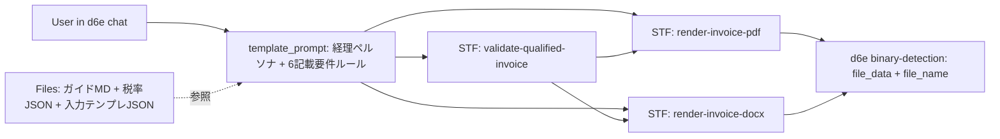

# d6e-app-invoice-jp 実装プラン (v1.0.0)

関連 Issue: [#1](https://github.com/d6e-ai/d6e-app-invoice-jp/issues/1)

## 概要

インボイス制度（適格請求書等保存方式）に準拠した請求書・簡易請求書・返還請求書を、PDF と Word (docx) の両形式で生成・検証できる d6e App を本リポジトリに新規作成し、Verified App としてマーケットプレイスに登録する。

## 目的とゴール

freee の解説記事に挙げられた**適格請求書の 6 つの記載要件**をすべて満たした帳票を、d6e のチャット UI から自然言語で生成できるようにする。出力は PDF・Word (docx) の両方に対応し、3 種類の関連帳票（適格請求書／適格簡易請求書／適格返還請求書）を共通基盤で扱う。

## アーキテクチャ概要



## 利用フロー（JSON ペースト主軸 + 対話フォールバック）

主たる使い方は「ユーザーが自社システムや手元で組み立てた JSON オブジェクトを d6e チャットに貼り付けて投入」する運用。対話モードは **JSON が用意できないユーザーのフォールバック**として残す。

```mermaid
flowchart TD
  start[ユーザーがチャットを開く]
  branch{入力パターン?}
  paste[JSONペーストモード: 完成JSONオブジェクトを貼り付け]
  request[テンプレ要求: AIがfiles/invoice-input-template.jsonの中身を提示]
  interactive[対話フォールバック: AIが不足項目を一問一答で収集]
  normalize[AIがJSONをパース・不足項目を補完確認]
  callValidate[validate-qualified-invoice STF実行]
  ok{valid?}
  fix[AIがerrors[]をユーザーに提示して修正依頼]
  callPdf[render-invoice-pdf STF実行]
  callDocx[render-invoice-docx STF実行]
  done[d6e UIがPDF/Wordをダウンロード可能に]

  start --> branch
  branch -->|"JSONを貼った / JSONで作って"| paste
  branch -->|"雛形ちょうだい / 入力フォーマット教えて"| request
  branch -->|"JSONがない / 自然文で依頼"| interactive
  request --> paste
  paste --> normalize
  interactive --> normalize
  normalize --> callValidate
  callValidate --> ok
  ok -->|No| fix --> normalize
  ok -->|Yes| callPdf
  callPdf --> callDocx
  callDocx --> done
```

パターン判定のキーワード例（`template_prompt` に明記）：

- **JSON ペーストモード（主）**: チャットに ` ```json ... ``` ` 形式のコードブロックが含まれる／「この JSON で」「下のデータで作って」など
- **テンプレ要求**: 「雛形」「テンプレート」「入力フォーマット」「サンプル JSON」「どんな形で渡せば良い」など → `files/invoice-input-template.json` の中身をそのままチャットに返し、ユーザーに編集用コピペ素材として渡す
- **対話フォールバック**: JSON も雛形要求もなく「請求書を作って」とだけ言われた場合 → 一問一答で 6 要件を収集し、最終的に同じ JSON 形状に組み立ててから `validate-qualified-invoice` に渡す

## ユーザー入力スキーマ（3 STF 共通）

3 種類の STF すべてで、以下の統一スキーマを受け付ける（`validate-qualified-invoice` の `input_schema` として定義し、PDF/docx STF でも同じ形を利用）。必須/任意は `document_type` により動的に切替わる。

```json
{
  "document_type": "qualified_invoice",
  "document_number": "INV-2026-0421-001",
  "transaction_date": "2026-04-21",
  "issue_date": "2026-04-21",
  "issuer": {
    "name": "株式会社サンプル商事",
    "registration_number": "T1234567890123",
    "address": "東京都品川区大崎1-2-3",
    "contact": "TEL: 03-1234-5678 / invoice@example.co.jp",
    "logo": { "format": "png", "data_base64": "iVBORw0KGgo..." }
  },
  "recipient": { "name": "ABC商店 御中", "address": "東京都渋谷区道玄坂1-1-1" },
  "items": [
    { "description": "ノートパソコン A", "quantity": 2, "unit_price": 89800, "tax_rate": 0.10 },
    { "description": "会議用弁当", "quantity": 10, "unit_price": 800, "tax_rate": 0.08 }
  ],
  "price_mode": "tax_excluded",
  "rounding_method": "floor",
  "payment": {
    "due_date": "2026-05-31",
    "bank_info": "〇〇銀行 品川支店 普通 1234567 カ)サンプルシヨウジ"
  },
  "notes": "振込手数料は貴社ご負担にてお願い申し上げます。",
  "return_info": {
    "original_document_number": "INV-2026-0301-005",
    "return_date": "2026-04-21",
    "reason": "商品不良による返品"
  }
}
```

### 必須/任意（帳票タイプ別）

- **共通必須（6 記載要件に直結）**:
  - `issuer.name`、`issuer.registration_number`（`/^T\d{13}$/` を満たすこと）
  - `transaction_date`（`YYYY-MM-DD`）
  - `items[]` と各要素の `description` / `quantity` / `unit_price` / `tax_rate`（`0.10` または `0.08`）
  - `recipient.name`（簡易インボイスのみ任意）
  - 税率区分合計・税率ごと消費税額は **STF が自動計算**するのでユーザー入力不要
- **`document_type` = `simplified_invoice`**: `recipient.name` は任意
- **`document_type` = `return_invoice`**: `return_info.reason` と `return_info.original_document_number` が必須
- **任意**: `issuer.address` / `issuer.contact` / `issuer.logo` / `document_number` / `issue_date` / `payment.*` / `notes` / `price_mode` / `rounding_method`

### ロゴ画像対応（オプション）

`issuer.logo.data_base64` に base64 エンコード済み画像（PNG/JPG）を渡すと、帳票ヘッダーにロゴを埋め込む。サイズは最大 120 × 48pt でアスペクト比を保って自動フィット。

- PDF: `@d6e-ai/pdf-lib` の `pdfDoc.embedPng(bytes)` / `embedJpg(bytes)` → `page.drawImage`
- docx: `@d6e-ai/docx` の `ImageRun({ data: Uint8Array, transformation: { width, height } })`
- base64 → Uint8Array 変換は `atob` が返す binary string を `charCodeAt` で展開する
- ロゴ未指定時は文字のみのヘッダーにフォールバック

## ディレクトリ構成

```
d6e-app-invoice-jp/
├── template.yaml              # d6e App マニフェスト (namespace=d6e, name=invoice-jp)
├── README.md                  # 日英バイリンガル説明
├── CHANGELOG.md               # v1.0.0 初回リリース
├── LICENSE                    # MIT
├── prompt.md                  # template_prompt 原本
├── stfs/
│   ├── validate-qualified-invoice.js
│   ├── render-invoice-pdf.js
│   └── render-invoice-docx.js
└── files/
    ├── invoice-requirements-guide.md
    ├── tax-rates.json
    └── invoice-input-template.json
```

## 主要ファイルの実装方針

- `template.yaml`: `namespace: d6e` / `name: invoice-jp` / `version: v1.0.0`、日英 `description`、`template_prompt`（3 モードの判別ルール含む）、3 STF + 3 files。`workflows` / `effects` は不要。
- `stfs/validate-qualified-invoice.js`: 6 要件チェック / 登録番号正規表現 / 税率区分集計 / 税率ごとに 1 回の端数処理 / `document_type` 分岐。戻り値 `{ valid, errors[], warnings[], totals, normalized_payload }`。
- `stfs/render-invoice-pdf.js`: `@d6e-ai/pdf-lib` + `@d6e-ai/fontkit` + `@d6e-ai/mplus-1p-regular`、A4 縦、帳票タイプ別タイトル、明細表、軽減税率 `※` マーク、ロゴ埋め込み。`btoa(await pdfDoc.save())`。
- `stfs/render-invoice-docx.js`: `@d6e-ai/docx`、MS Gothic、A4、PDF 版と同等レイアウト、`Packer.toBase64String(doc)`。
- `files/invoice-requirements-guide.md`: 6 要件詳細・簡易インボイス対象業種・登録番号書式・端数処理ルール・返還請求書ユースケース。
- `files/tax-rates.json`: 標準 10% / 軽減 8% のマスタデータ。
- `files/invoice-input-template.json`: 3 帳票タイプ分のコピペ用テンプレ（プレースホルダー入り）。

## 検証

- `npx ajv-cli validate -s d6e-app-skills/schema/template.schema.json -d template.yaml`
- 各 STF を `node --check` で構文チェック
- QuickJS 固有の制約（`toLocaleDateString` 禁止・`Intl` 不可）は目視レビュー

## マーケットプレイス登録フロー

1. `feature/initial-implementation` → `main` の PR を `Closes #1` 付きで作成。
2. リポジトリに `d6e-app` トピックを付与（`gh repo edit --add-topic d6e-app`）。
3. `d6e-ai/d6e-app-marketplace` の `verified-apps.yaml` に以下を追記する別 PR を `feature/add-invoice-jp` ブランチで作成。

```yaml
- namespace: d6e
  name: invoice-jp
```

## スコープ外（将来拡張）

- 領収書・納品書・支払明細書テンプレート（同じ STF 基盤で追加可能）
- 媒介者交付特例対応
- Workflow 定義（チャット駆動で十分なため）
- Effects による外部連携（メール送信・ストレージアップロード等）
- 多言語 UI（`template_prompt` 自体は日本語固定）
